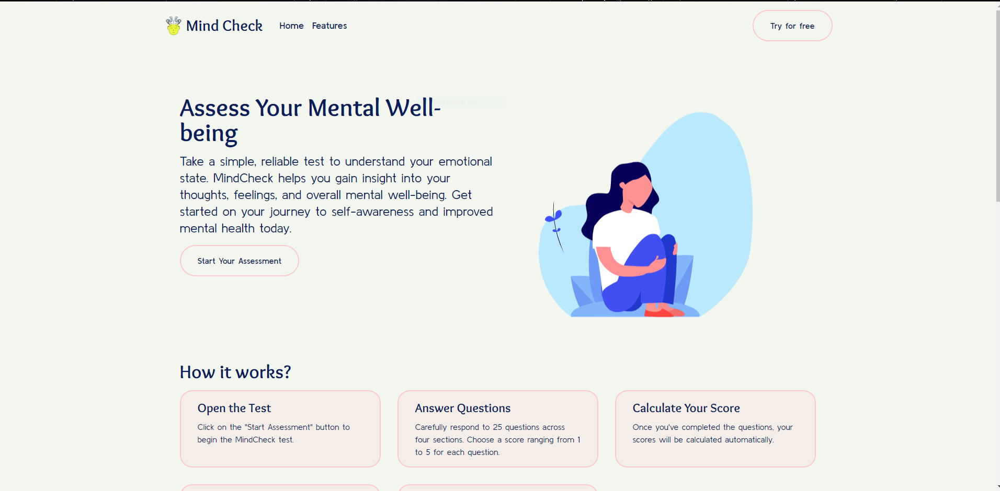

# Mind Check

    

Mind Check is a web application designed to help individuals assess and track their mental well-being. It provides users with a series of tests to evaluate various aspects of their mental health and provides personalized feedback based on the test results.

## Features

- **Free Test and Feedback**: Mind Check offers a collection of mental health tests that users can take for free. After completing a test, users receive personalized feedback based on their responses.

- **User Accounts**: Users have the option to create an account to store their test data and access additional features. Creating an account allows users to view their test history, track their progress over time, and receive recommendations for improving their mental well-being.

- **Secure Data Storage**: Mind Check utilizes Firebase, a cloud-based platform, for secure data storage and authentication. User data, including test results and personal information, is encrypted and protected.

- **Curated Resources**: A treasure trove of articles and blogs, personalized to your mental health test results. Unlock valuable insights, strategies, and self-care tips, empowering you to thrive on your emotional well-being journey. Written in Markdown and rendered in JSX.

- **AI-powered Feedback**: (Coming Soon!) The application leverages AI algorithms to provide customized feedback based on the user's test inputs. This feedback is designed to offer insights, suggestions, and resources to support the user's mental well-being.

## Tech Stack

The Mind Check application is built using the following technologies:

- **React**: A popular JavaScript library for building user interfaces. React provides a modular and efficient way to create interactive components.

- **TypeScript**: A typed superset of JavaScript that improves code maintainability and scalability. TypeScript enables static type checking, enhancing code reliability and developer productivity.

- **Vite**: A fast and lightweight development server and build tool for modern web applications. Vite offers quick startup times and efficient bundling, optimizing the overall development experience.

- **Firebase**: A comprehensive platform for building web and mobile applications. Mind Check utilizes Firebase for backend services, including authentication, data storage, and hosting. Firebase provides scalability, real-time updates, and robust security.

- **pnpm**: A fast and disk-space-efficient package manager. pnpm offers a lightweight alternative for managing project dependencies, optimizing package installation and update processes.

## Getting Started

To get started with Mind Check locally, follow these steps:

1. Clone the repository: `git clone https://github.com/Nika69420/mind-check.git`
2. Navigate to the project directory: `cd mind-check`
3. Install dependencies using pnpm: `pnpm install`
4. Start the development server: `pnpm dev`
   The app will be running at `http://localhost:5173`.
